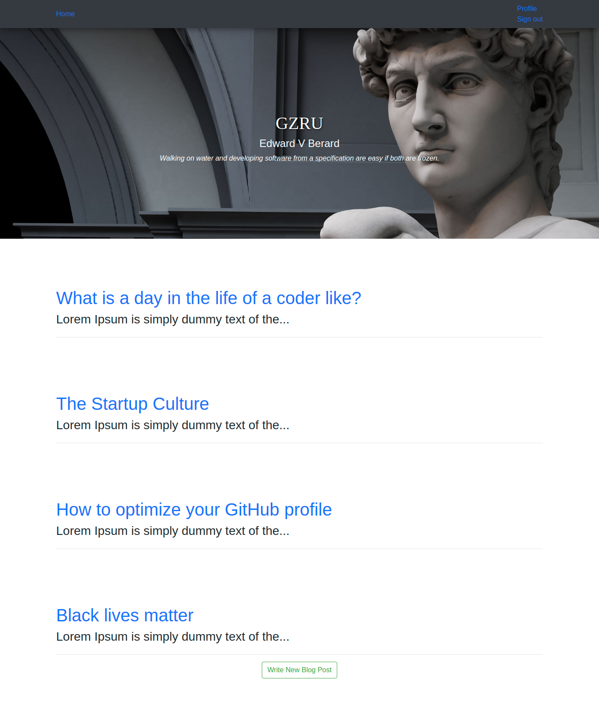

# Personal Blog

### Author
 **[Isaac Gichuru.](https://github.com/Isaacg94)**

## Description

A web application made using Python's Flask that allows a user to create blog posts on the webpage.

**[Live-Link to site.](https://personal-blog-isaac.herokuapp.com/)**
## Features
* A landing page with a list of all the posted blogs.
* A display of random quotes.
* A link to create a new blog posts.
* A navigation bar with options to sign-in, navigate to your profile, sign-out and navigate back to the home-page.
* A link to navigate to the full blog post.
* An option to delete the post once on the full blog post.
* An option to comment on the blog post.

## Behaviour Driven Development (BDD)
|Behaviour 	           |    Input 	                 |       Output          |
|----------------------------------------------|:-----------------------------------:|-----------------------------:|       
|    Page loads, landing page with a list of all the posted blogs appears.    |    The user, after signing-up or signing-into their account as a writer, can click on add new, and submit their own blogs.   |    The blog-post they create is added to the list of blog posts in the landing page.    |                       |

## Setup/Installation Requirements
Here is a run through of how to set up the application:
* Step 1 : Clone this repository using the git clone link:
  * **`git clone https://github.com/Isaacg94/personal-blog.git`**
* Step 2 : Navigate to the directory:
  * **`cd personal-blog-master`**
* Step 3 : Open the directory created with your favorite IDE. If Atom type **`atom .`** if VSCode type **`code .`** . This will lauch the editor with the project setup,
* Now feel free to hack around the project.

## Known Bugs
* Currently None.

## Technologies Used

- Python 3.6.8
- HTML
- CSS
- Bootstrap 4.3.1

## Support and contact details

Primary E-mail Address: 7248zack@gmail.com

### License
*MIT License* 

Copyright (c) 2019 **Isaac Gichuru**